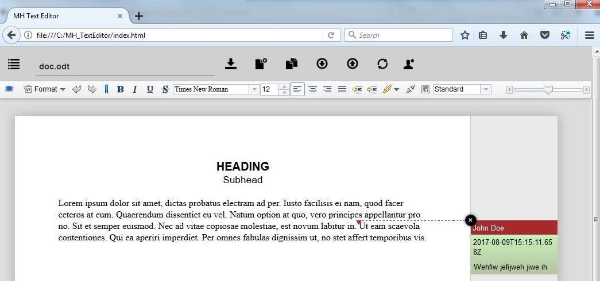
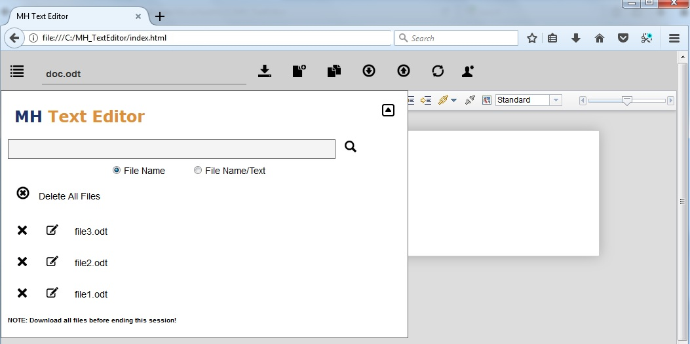
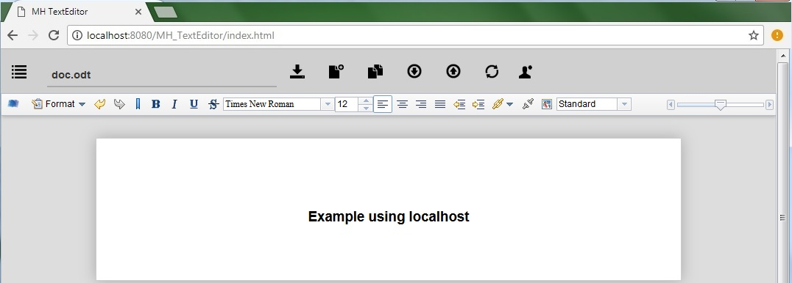

# MH_TextEditor
App adds enhanced features to Wodo.TextEditor.
- Saves user name (for annotations) to localStorage; with Reset button.
- Has a Files Listing/Search Panel for the files the user has saved/edited for the session.
  Users download the files prior to ending the session.
- To Copy/Save As a file, click the edit button next to a file name that is already saved on the Files Listing/Search Panel,
  or upload a file; change the file name, make edits, and click the Save button.
- Search by file name or file content.

## Instructions
- Download files.
- Open a browser.
  If using Firefox or Safari, drag the index.html file onto the browser window (see screenshots above).
  If using Chrome, Opera, or any other browser that will not load index.html completely, 
     view the index.html file using a local web server (localhost, see screenshot below).

